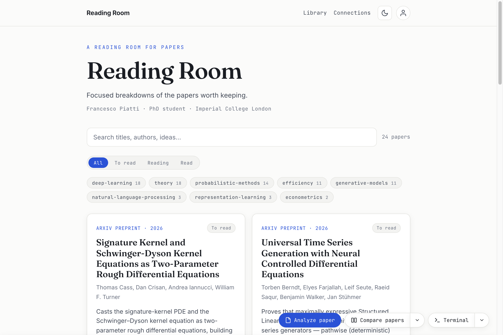
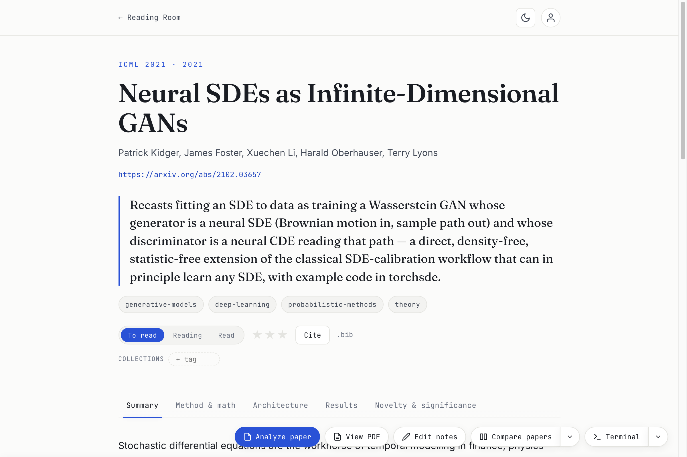
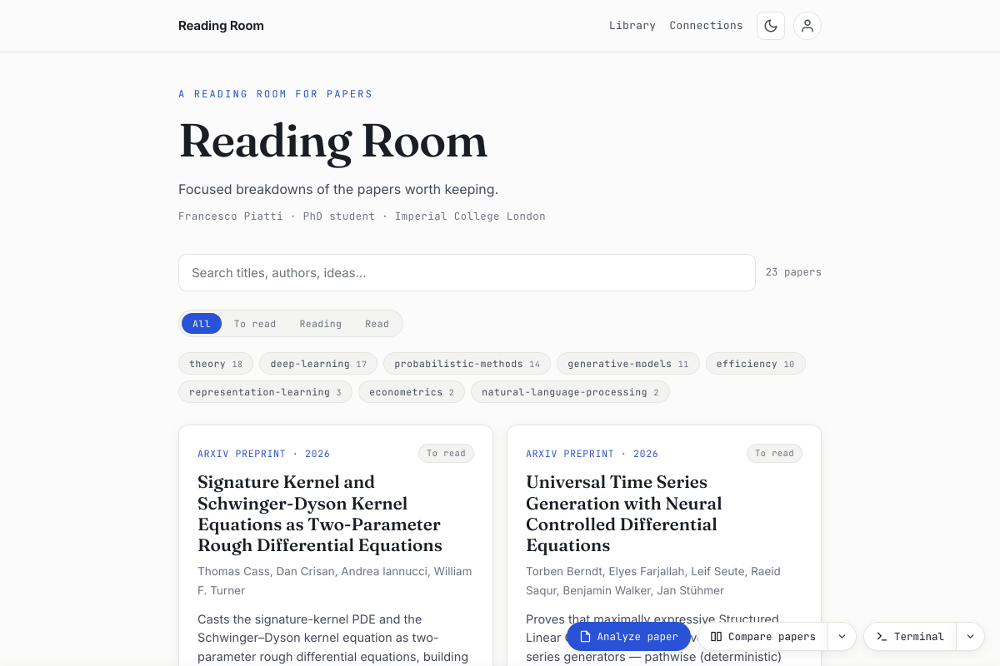
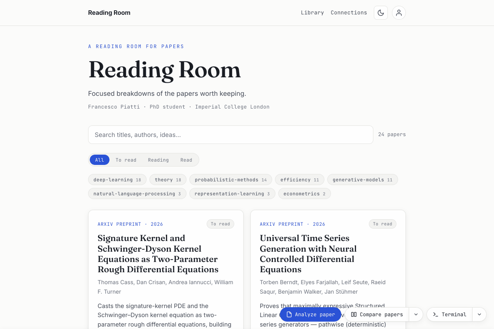

# Reading Room

A personal reading room for papers. Open the app, click **Analyze paper**, paste an arXiv id (or a PDF) — and your own AI coding assistant reads the paper **once** and writes a focused, multi-tab report into a searchable catalogue you own, open locally or host free on GitHub Pages.

**It adapts to you.** A short Setup picks your field(s) and seeds a tag vocabulary + the focus-view tabs each report is split into — both editable, in any discipline (ML/maths, bio, econ/finance, engineering, medicine, …). Each paper is then **divided into the topics that fit *that* paper**, anchored on your defaults and pitched to your profile. Summary and Significance are always written; the rest adapts.

## No API key needed
Reports are written by **your own AI coding assistant** — [Claude Code](https://docs.claude.com/en/docs/claude-code/overview), Codex CLI, or Gemini CLI — running interactively inside the app, under the subscription you already have. There is **no API key to create, no API billing, no separate account**, and nothing leaves your machine except the assistant's own traffic, a version check against GitHub on launch and every few hours (no library data is sent), arXiv when you open a PDF, and MathJax's CDN for equations. The build is plain Python with **no dependencies**.

## What it looks like

| The catalogue | A report |
|---|---|
|  |  |

| Analyze a paper, start to finish | The app tour |
|---|---|
|  |  |

## Setup
1. **An AI coding assistant — required.** [Claude Code](https://docs.claude.com/en/docs/claude-code/overview), Codex CLI, or Gemini CLI, installed and logged in (its CLI must run from a terminal). It is the author of every report, covered by your existing subscription — no API key, no separate account.
2. **Python 3.8+** and **[Node.js](https://nodejs.org/) 18+** — both free. You never run them yourself; the app uses them under the hood and tells you if one is missing.
3. **Clone this repository** — paste one line and you're done. It lands in your home folder (a safe spot: not Desktop, not OneDrive — see the first-launch notes) and the folder opens by itself:
   - **macOS** (Terminal): `cd ~ && git clone https://github.com/FrancescoPiatti/Reading-Room.git ReadingRoom && open ReadingRoom`
   - **Windows** (PowerShell): `cd ~; git clone https://github.com/FrancescoPiatti/Reading-Room.git ReadingRoom; explorer ReadingRoom`
   - **Linux**: `cd ~ && git clone https://github.com/FrancescoPiatti/Reading-Room.git ReadingRoom && cd ReadingRoom`

   (Forking first works too, and so does a download: each [release](https://github.com/FrancescoPiatti/Reading-Room/releases) carries a ZIP per platform with the app's dependencies already built, so the first launch doesn't have to install anything. Both install methods update from the avatar menu — a clone via git, a download via the published release.)
4. **Double-click `ReadingRoom.app`** (macOS), **`ReadingRoom.bat`** (Windows) or **`ReadingRoom.sh`** (Linux; it also adds a menu entry on first run). The app opens with a short tutorial, hands off to **Setup** (your field, focus views, defaults), and offers to add a **Reading Room shortcut** — on your **Desktop** or in your **Applications folder** (Start Menu on Windows). You can decline ("Not now" on macOS, "Cancel" on Windows); to get the offer again, delete `user/.desktop-shortcut-offered` and relaunch.

Two example papers ship in the catalogue (*Attention Is All You Need* and Hornik's universal-approximation theorem) so the first launch isn't empty and you can see finished reports — keep them, or remove them once you've added your own.

## Use it
Everything is **one click** in the app — there is no terminal to look at.

- **Analyze paper** (the big button) takes an arXiv id, an arXiv/PDF URL, or a **PDF from your computer** — **Choose PDF…**, or drop one anywhere on the panel. Most fields aren't on arXiv, and a paywalled paper is just a file in your Downloads: that file goes into the catalogue the same way. Your assistant reads the paper, writes the report, the site rebuilds itself, and **Open report** appears when the card is ready.
  - **A stack, not one paper.** **Add another** queues what you typed and clears the box (dropping several PDFs at once queues them all); the button then reads *Analyze N papers* and works through them one after another, telling you which one it is on.
  - **Options** — depth (skim / standard / deep), audience (peer / newcomer) and a **focus** for this run only. Left alone, your profile's defaults apply.
  - While it runs, the card shows how long it has been going and the assistant's last line — and closing the window is safe: the app keeps the run going and finishes writing the report.
- The **▾** next to it switches flow:
  - **Compare** — pick 2–3 papers (a search box filters the list) and optionally type a **question or topic** ("which handles long sequences better, and at what cost?"); the comparison is then organised around answering it.
  - **Discuss** — a live conversation about a paper. This is the one flow that opens the terminal, because you talk to it; **End chat** saves the compacted conversation as a Discussion below the reading list.
  - **Deep dive** — a worked derivation / proof / mechanism trace, added to an existing report as its own "Deep dive" tab or merged into a section you choose.
- **Stop** — every running flow has a Stop button. Stopping (from the app, or by quitting the assistant in the terminal) discards the run: nothing half-written is added to your library.
- **Show terminal** reveals the live session if the assistant asks you something, and the app warns you if it goes quiet mid-run.
- **Back up** (avatar menu) — a **full backup**: one zip with your reports, notes, comparisons, discussions, settings, optionally the downloaded PDFs, *and* your browser reading state (status, stars, collections). Save it to Downloads, the app's `backups/` folder, or a path you choose. **Restore from zip** brings it all back (merge, or replace everything) — this is how you move to a new machine or a fresh copy. You can also have it **back up on its own** (daily, weekly or monthly, PDFs skipped), and one snapshot is always written just before an update.
- **Profile → Edit full profile** (avatar menu) — a free-form Markdown page about you: background, what you're working on, what you want from reports. Every report, comparison, discussion, and deep dive reads it and calibrates to you. **Save & review** saves it and has your assistant run `/setup --review-profile`: it reads the Markdown and brings `profile.json` / the field config in line with it (surgically, with a "What changed" review).
- **Assistant settings** (the gear next to the claude / codex / gemini pills, or Terminal ▾ → Assistant settings) — pick the **model** and **reasoning effort** each assistant launches with (Claude Code `--model`/`--effort`, Codex `-m`/`-c model_reasoning_effort=…`, Gemini `-m`). Blank means the CLI's own default; the choices are remembered in this browser and used by every flow button and Terminal ▾ launch.
- **Updates** (avatar menu) — the app checks for new versions and offers a **one-click update**, whether you cloned with Git (it fetches your clone's remote and fast-forwards; if it can't, your assistant finishes via `/update`) or downloaded a release (it reads the newest published **release**, not whatever was pushed last, and replaces the app's own files in place — preferring the packaged ZIP for your platform). A backup of your library is written first, every time. The "Update available" dialog offers **Later** (until the next launch), **Skip this version** (never for that version — a newer one is still offered) and **Update now**. Your library, notes and settings are never touched; if the app's own server files changed it offers a one-click **Restart now**.
- **Connections** — hollow **ghost nodes** on the graph (references cited by two or more of your papers but not yet read) become actionable: **Analyze** opens the Analyze flow with the id filled in, **Dismiss** hides one for good.
- Report pages get **View PDF** (opens the paper inside the app), **Edit notes** (your own notes, rendered under the report) and **Remove paper** (it lists exactly what will be deleted, and warns you about comparisons built on it); a discussion page gets **Remove discussion**.
- **Diagnostics** (avatar menu) — versions, which assistants were found, how this copy was installed, and the tail of the app's log, with a **Copy** button. The first thing to paste if anything misbehaves.
- The catalogue and the Library can be **sorted** (year, recently updated, title, priority, reading status); catalogue search reaches the full text of every report, the Library filter reaches ids, years and summaries.

*Prefer a terminal?* Open the **Terminal** drawer (or run `cd workmode && npm start`) and type the commands the buttons run: `/explain-paper <id | url | path.pdf>`, `/compare <id> <id> [<id>] [--focus "…"]`, `/learn <id> [topic]`, `/deep-dive <id> <topic>`, `/remove <id>`, `/refresh-venues` (update preprints to their published venue + BibTeX), `/setup`, `/backup export|import`, `/update`. Add `--approve` to skip a command's confirmation gate.

## Browse
`docs/index.html` is the catalogue: client-side search and tag filters, data embedded so it works by double-clicking — no server needed. Each report is a self-contained page with the focus views as tabs and live MathJax equations. Fonts and the search/graph libraries are **self-hosted** inside `docs/assets/` (nothing pings Google or a CDN about what you read, and everything but equation rendering works fully offline; without a connection LaTeX just shows as readable source).

## Host it (optional)
Push the repo to GitHub, then Settings → Pages → deploy from branch, folder `/docs`. The catalogue is live at your Pages URL. Downloaded PDFs are gitignored; `docs/` is deliberately **committed** — it's what Pages serves.

## The app, under the hood
One window with the catalogue, the flow buttons, and an **integrated AI terminal** (Claude Code, Codex CLI, or Gemini CLI) in a bottom drawer, with **live rebuilds** — the catalogue and graph refresh themselves as reports land. It's a small local server (`workmode/`) bound to loopback only, never exposed to the network. The static site underneath (`docs/`, openable directly or hosted on GitHub Pages) keeps working without it — see "Browse".

**Launch it:** double-click **`ReadingRoom.app`** (macOS), **`ReadingRoom.bat`** (Windows) or **`ReadingRoom.sh`** (Linux). First run installs its dependencies (1–3 minutes, with a notification up front — a packaged release ZIP skips this) and makes the shortcut offer; each launch then starts the server **in the background** and opens a chromeless app window. With `ReadingRoom.app` **no Terminal window appears at all** (errors, if any, show as a dialog). *(Alternative: `cd workmode && npm start` runs the same server in the foreground with visible logs.)*

> **macOS first-launch notes.** The app is unsigned, so Gatekeeper may block the first open — on macOS 15 and later open **System Settings → Privacy & Security** and click **Open Anyway** next to the blocked app (older macOS: right-click the app → **Open**), or run `xattr -dr com.apple.quarantine ReadingRoom.app`. On Windows the first double-click of a downloaded `ReadingRoom.bat` may show SmartScreen — click **More info → Run anyway**. **Where the folder lives matters:**
> - Best: a plain local folder like `~/ReadingRoom` or `~/GitHub/reading-room`.
> - Desktop / Documents / Downloads / OneDrive / iCloud are **privacy-protected (TCC)**: macOS gates each app's file access there. If double-click does nothing or you see a *"macOS is blocking…"* dialog, grant access once in **System Settings → Privacy & Security** (Files & Folders, or Full Disk Access → **+** → add `ReadingRoom.app`) and open it again. Updating the app can reset this — same 10-second fix.
> - Cloud-synced folders (OneDrive/iCloud/Dropbox) also **evict file contents to the cloud** ("free up space"); the server then hangs or dies at startup on the placeholder files. If you must keep it there, right-click the folder → **Always Keep on This Device** — but a plain local folder avoids all of this.

Each flow launches your chosen assistant (`claude`, `codex`, or `gemini`) in a hidden session, runs the command, and tells you when the result is ready. The terminal drawer never opens itself — it's there behind the **Terminal** button whenever you want to type commands yourself (the ▾ next to it starts an assistant). The app window is chromeless, so external links (e.g. arXiv) open in your normal browser instead of stranding the window. The server runs **headless in the background**; **closing the app window stops it** a few seconds later (so a refresh doesn't kill it). Its output goes to `workmode/workmode.log`, and you can force-stop it with `kill $(cat workmode/workmode.pid)` (macOS) or via Activity Monitor / Task Manager. Set `RR_KEEPALIVE=1` to keep it running after the window closes, or `RR_PORT=5000` to change the port. An in-app update restarts the server for you (the launchers relaunch it automatically; if you started it with `npm start`, just run it again).

**Works on macOS, Windows and Linux.** `ReadingRoom.app` (macOS), `ReadingRoom.bat` (Windows) and `ReadingRoom.sh` (Linux) are equivalent; the server, UI, live rebuild, flows, backup, and updates are all cross-platform. On macOS the launcher carries a custom icon — if cloud sync ever strips it, `bash assets/build-icon.sh` reinstalls it; on Linux the first run offers to add a menu entry.

**Reading state** — status, priority stars, collections, dismissed graph nodes — is saved in `user/reading-state.json` as you click, as well as in the browser. It therefore survives a different browser, a port change, and a restore from backup. (On the static site, with no app running, the browser is the only store — that's what the JSON export in **Back up** is for.)

**A note on the terminal component:** the integrated terminal uses `node-pty`, which installs a prebuilt binary when one exists for your Node version, otherwise compiles it — that needs a C/C++ toolchain (macOS: `xcode-select --install`; Windows: "Desktop development with C++" Build Tools). If it can't build, everything except the terminal still works.

## Make it yours
- **Profile & setup**: the **avatar** in the header opens **Profile** and **Setup** — a short questionnaire for your name, field(s), default focus views (**add your own**), tag vocabulary, and depth/audience. Finishing runs `/setup` for you, which writes `user/profile.json` + `user/config.json` and seeds `user/profile.md`; the commands read those at runtime, so reports adapt **without editing any command files**. **Edit full profile** (in the Profile view) lets you write as much as you like about yourself in Markdown. Config lives under `user/` (gitignored), so app updates never overwrite it.
- **Fields & focus views**: choose discipline packs or edit your own in Setup (or `user/config.json`) — tag vocabulary, focus-view tabs, lens, and tone. The shipped default is a general, math-derived vocabulary; make it yours. Each report still adapts its sections to the paper at hand.
- **Rename the site**: set `"site_title": "My Reading Room"` in `user/config.json` — the header, page titles, and footer all follow. (The repository may be published under a different name; the app inside is whatever you call it.)
- **Restyle**: everything visual lives in `templates/base.css`; rebuild to apply.
- **Reading status & priority**: each report and the Library page let you set status (to-read / reading / read) and a 0–3 star priority, plus free-form **collections**; choices persist in your browser and travel with the full backup.
- **Go deeper**: **Deep dive** adds a worked derivation as a "Deep dive" tab or merges it into a section; **Discuss** talks a paper through and saves the compacted chat as a Discussion below the reading list.

### Configuration reference — `user/config.json`
Setup writes this for you; every key is optional and hand-editable:

```jsonc
{
  "site_title": "Reading Room",              // header / page titles / footer
  "fields": ["ml"],                           // shipped packs to merge, from templates/fields/
  "tags": ["deep-learning", "theory"],        // explicit vocabulary — WINS over the packs
  "max_tags": 4,                              // per-paper soft cap (scripts/verify.py warns above it)
  "sections": [                               // focus-view tabs, in display order
    {"key": "summary", "title": "Summary"}
  ],
  "required_sections": ["summary", "significance"],
  "lens": "over-invest in the math",          // what reports lean on hardest
  "lens_key": "math",                         // which section is the lens view
  "tone": "technical, direct"                 // report voice
}
```

How merging works: `fields` unions the named packs' tag vocabularies **in the order listed**, and takes each section from the **first** pack that declares its key — so `["bio", "ml"]` and `["ml", "bio"]` differ in tab order/titles. Anything you set explicitly here (e.g. `tags`) **wins over** the packs, which only fill in what you omit. Two rules: keep tags broad (2–4 per paper, the build enforces the vocabulary), and **never rename a section `key`** — keys like `math` are storage keys inside every existing digest (a pack/config only retitles them, e.g. "Methods & statistics"); renaming one blanks that tab on every report. Adding *new* keys is always fine.

## License
[MIT](LICENSE) © Francesco Piatti. Your own paper digests, notes, and PDFs are yours; the license covers the Reading Room tooling. The footer credit ("created by Francesco Piatti") is the tool's attribution and is hardcoded in `scripts/build.py` — forks are welcome under the MIT terms and may keep or amend it; `site_title` renames everything else without touching it.
